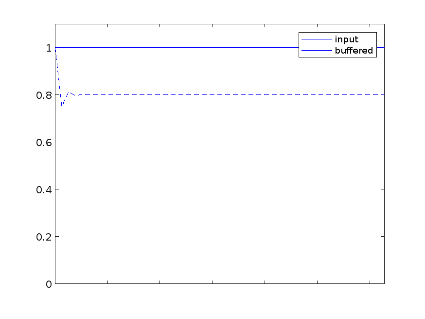
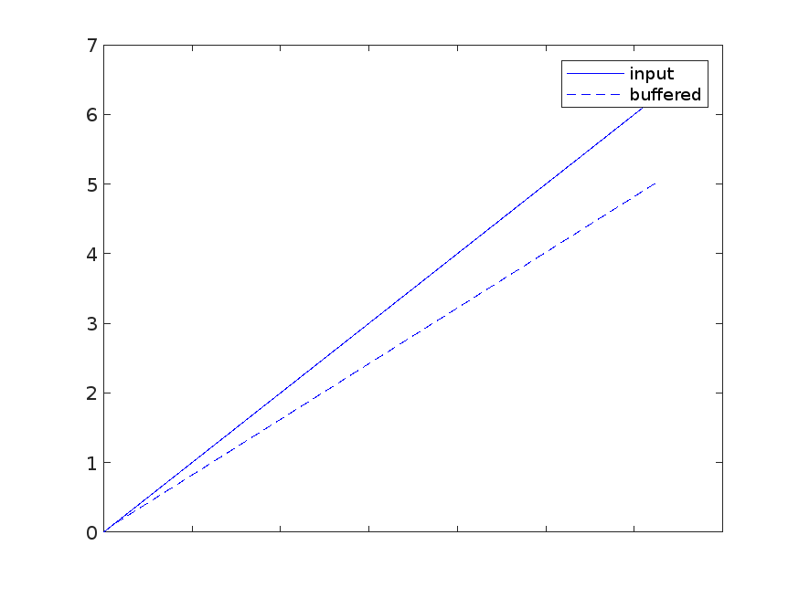
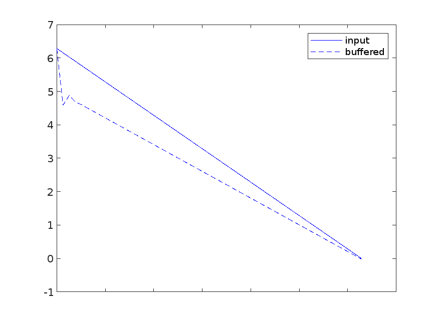
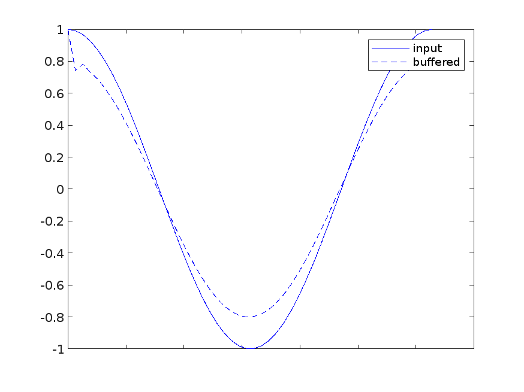
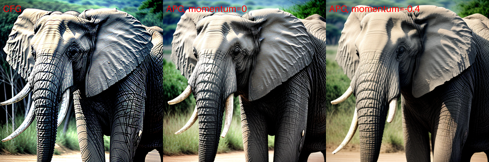
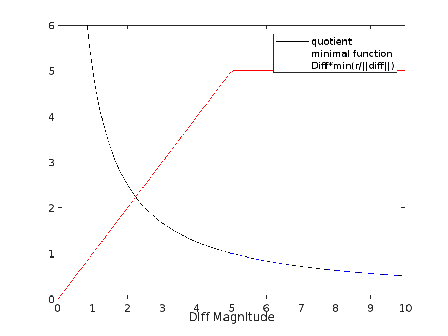
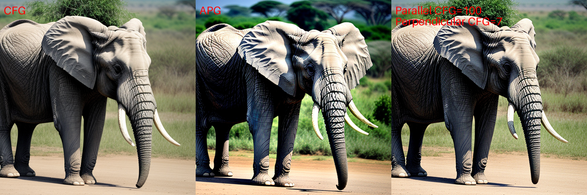
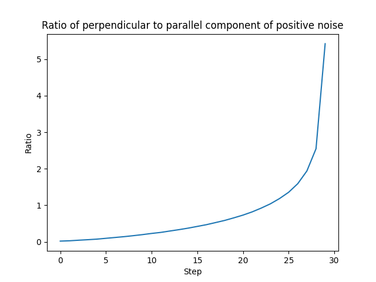

# APG_Experiments
APG and further modifications for InvokeAI  


## Source:  
A little while ago some folks (at Zürich ETH/Disney?) released this paper: https://huggingface.co/papers/2410.02416  
In it they describe a some interesting modifications to CFG to prevent the burn-in effect from setting too high of a guidance.  
First, they separate the noise prediction delta (unscaled CFG result) into parallel and perpendicular components with respect to the in-progress image. This result is then gain limited.
Second, they add a form of negative momentum gain to prevent overshoot in the combined result.  

To me, this smacks conveniently close to a PD feedback loop, and I had originally set out to explore modifications of APG to this effect. However, in analyzing the implementation I have found that it is not quite the innovative sollution it purports to be and is instead mostly some convoluted math that generally reduces CFG. I have written code here to create a proper implementation of PID-CFG and some tests for perpendicular noise prediction limiting, but the results are not promising. I may revisit in the future, but for now I'm going to leave this where it is.


## The APG Implementation 1 - MomentumBuffer  
APG makes a few useful but oddly formulated adjustments to the magnitude of the Diff. First, it is important to recall that SD1.5 and SDXL are not trained to give the same linear trajectories that transformer models like SD3 are. SD/XL meander, and may reverse directions multiple times during the denoising process. With that in mind, we need to take a look at the MomentumBuffer that APG applies. MomentumBuffer somewhat offsets the result based on the slope of the Diff, but not exactly, and it does it in such a strange way that I'm surprised it works at all. First, the algorithm:
```python
class MomentumBuffer:
    def __init__(self, momentum: float):
        self.momentum = momentum
        self.running_average = 0

    def update(self, update_value: torch.Tensor):
        new_average = self.momentum * self.running_average
        self.running_average = update_value + new_average
```
And importantly, Diff is modified every step by:
```python
if momentum_buffer is not None:
    momentum_buffer.update(diff)
    diff = momentum_buffer.running_average
```

Starting at the second step, each iteration sets the current "running average" to be a scalar multiple of the current value. If we set the momentum offset to -0.25 and feed a constant signal, we can see that the output is unstable at the start and settles at a value 0.8x the input.


Plotting a few other signal results, an ascending input will return a scaled result similar to the constant input, but without an instability at the start as long as the signal begins at zero. A cosine signal again shows a scaled result in both positive and negative regions, with a phase shift of 1 timestep and the same instability at the start. When descending, the momentum offset and the input signal converge together towards zero.

Ascending   |  Descending   |  Cosine
:-------------------------:|:-------------------------:|:-------------------------:
   |    |  

Reducing the CFG at the start of denoising and linearly increasing it back to full value towards the end has been investigated before (https://arxiv.org/abs/2404.13040), but this is not a clean way to achieve that effect. This MomentumBuffer implementation means that the first step will be unaffected, the second step will be overcorrected, and the remaining steps will trend towards some scalar value that is unintuitively not exactly offset by the chosen momentum value. It is effectively reducing the equivalent CFG more or less uniformly throughout the process except at the very start and end.

However, since we expect the direction of individual pixels to move at specific stages of denoising and stabilize, this does have the effect in the very short term of resisting sudden changes in direction on a per-pixel basis.



We can see that the momentum changes have a positive effect on the result, both in the paper's quantitative analysis and by testing the implementation directly. This just isn't an ideal way to do what is otherwise a simple scaling operation based on the timestep. Instead, it would be better to base a momentum restrictor on the intra-step difference in latent image.

## The APG Implementation 2 - Rescaling  
The Rescale method here is more similar to a clamping function that prevents the magnitude of the resulting Diff from being higher than the provided norm. It scales when the threshold is crossed, but that threshold is largely arbitrary. Example in the scalar case with r=5:


The norm of Diff starts low and increases to a plateau for most of the process before falling back towards zero in the final steps. The norms of each conditional/unconditional noise prediction are actually decreasing constistently throughout the process as timestep counts down to zero, but the angle between them increases as image features are developed so the Diff behaves in a more complex manner. The exact level that it approaches varies based on the model and the prompt, so a hard limit is not necessarily the best application. CFG Rescale (https://arxiv.org/pdf/2305.08891) methods are already able to limit the output in a way that keeps magnitudes of pixels relative to each other in line with the CFG input scale. Similarly dynamic thresholding mods (https://github.com/mcmonkeyprojects/sd-dynamic-thresholding?tab=readme-ov-file) make adjustments to the standard deviation of the Diff, preventing extreme outliers from blowing out the results.

So we should consider that Diff increases to a plateau, at some point triggering the rescale clamping function and preventing it from overshooting to some extent. This is a good method to prevent velocity results that are too high, but it limits arbitrarily instead of adaptively. It also acts uniformly on the entire Diff tensor, rather than on the parallel and perpendicular components. By the paper's own logic, I would expect clamping like this to be applied on the parallel vector only. As it is, a user can synthetically do that by increasing the guidance and reducing the eta, but that has adverse affects on the orthogonal component.


## What To Do
I would argue that, rather than "adaptively" restricting CFG artifacts as the name implies, these two methods are simply arbitrary scalar and threshold reducers of CFG. In a steady state, MomentumBuffer reduces the effective values in Diff. If you are comparing a high CFG against a high CFG that has been reduced by 20% and looking for artifacts from having the CFG too high... well you're going to see less of those in the one that you reduced by 20%. Rescale is more adaptive in that it flattens the Diff's norm trajectory, but again the main benefit is that user is insulated from the too-high value of CFG they set without knowing that it is just being ignored for a lower value in the background.

But all is not lost, because we have some nuggets of interesting interpretation still here, namely the "projection" component of APG. If the model is returning noise predictions that correlate to a distance feedback to some desired state, then separating the Diff into parallel and orthogonal components relative to the current latent image means that we can apply special processing towards just the parallel component (theoretically the one with a static distance in the moment). However, the APG implementation does not compute over a component orthogonal to the current latent, but to the positive noise prediction. Once again this is theoretically applicable in a DiT model, but as it is applied here it makes the assumption that limiting the effects of CFG in the direction of the positive noise prediction will prevent overshooting. Effectively a third way of simply reducing the CFG and again more transformative than adaptive.


## Investigating Split CFG
Hypothesis: The Diff is in some part parallel and some part perpendicular to the existing latent, and by overshooting in the parallel component we cause the burnt look of a high CFG.  
To test, we can simply split the Diff into a perpendicular and parallel component with respect to the latents, and test the effects of increasing the gain on one of them. It turns out that the parallel component is miniscule, and the noise prediction diff is almost entirely perpendicular to the latent at all times. We can increase the parallel CFG up to 100 without seeing signficant artifacting. It has almost not effect on the output.
  
In fact, the magnitude of the orthogonal projection is regularly 70-300 times greater than the parallel. That being the case, we might have new context for what is happening with APG.
If the Diff vector almost entirely orthogonal to the latent image at all steps, what about the conditional noise prediction itself? We can trace that through a normal generation at CFG=7.  
  
We now have two important points to consider:
1. Diff is almost entirely perpendicular to the latent image at each step.
2. The positive noise prediction is parallel to latent image at the beginning of denoise and perpendicular at the end.

Let's consider the case at the end of denoising: APG splits and artificially limits the component of the Diff that is parallel to the positive noise prediction. Since the positive noise prediction is perpendicular to the latent at the end of denoising, the benefits of APG (which are almost entirely limit-based) near the end of denoising are to reduce the perpendicular projection of diff with respect to the latent image. That is to say, APG is reducing CFG towards the end of denoising, and that is all it is doing.